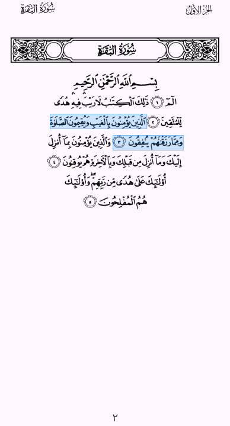

## Support Me

If you enjoy my work and want to support me, you can contribute via [Patreon](https://www.patreon.com/CodeJoint), [PayPal](https://paypal.me/yosfsyd), or [Buy me a coffee](https://www.buymeacoffee.com/youssef_sayed).  
Your support helps me keep creating and improving my projects!

[](https://www.patreon.com/CodeJoint)
[](https://paypal.me/yosfsyd)
[](https://www.buymeacoffee.com/youssef_sayed)

# Quran Pages with Ayah Detector

A Flutter package to display Quran pages (image-based) with tapable/selectable ayahs. This package also includes a modern Search UI and an Assets CLI tool for easy configuration.

## Features

- **Quran Page Rendering**: Display full Quran pages with high-quality images.
- **Ayah Detection**: Tap or long-press on any ayah to get its Surah/Ayah number and highlighted selection.
- **Search Functionality**: A built-in search overlay that allows users to find verses across the entire Quran and navigate directly to them.
- **Customizable UI**: Fully themeable components, including search input, status bar integration (SafeArea), and highlight colors.
- **Assets CLI**: Automated tool to fetch page images and fonts from remote repositories and configure them in `pubspec.yaml`.

## Installation

### 1. Make sure you're using flutter_lints v6

```yaml
dev_dependencies:
  flutter_lints: ^6.0.0
```

### 2. Add to pubspec.yaml

Add the dependency to your `pubspec.yaml`:

```yaml
dependencies:
  quran_pages_with_ayah_detector: ^1.1.0
```

or use

```bash
flutter pub add quran_pages_with_ayah_detector
```

## Setup (Assets CLI)

To fetch the required Quran pages (604 images) and fonts (605 files), use the included CLI tool:

```bash
# Register the CLI
dart pub global activate --source path ./bin

# Run the fetch command
quran_assets_cli fetch-assets --pages-dest assets/pages --fonts-dest assets/fonts -y
```

or

```bash
dart run quran_pages_with_ayah_detector:quran_assets_cli fetch-assets
```

This will:

1. Fetch 604 page images from the official repository.
2. Fetch 605 Quranic fonts.
3. Automatically update your `pubspec.yaml` with all 605 font declarations and asset paths.

## Preview

Should look like that in your project after installing the package & required assets:



## Usage

```dart
import 'package:quran_pages_with_ayah_detector/quran_pages_with_ayah_detector.dart';

// ... inside your widget tree
QuranPageView(
  onAyahTap: (surah, ayah, page) {
    print('Tapped on Surah $surah, Ayah $ayah on Page $page');
  },
  showSearchIcon: true,
  highlightColor: Colors.deepPurple.withOpacity(0.5),
)
```
